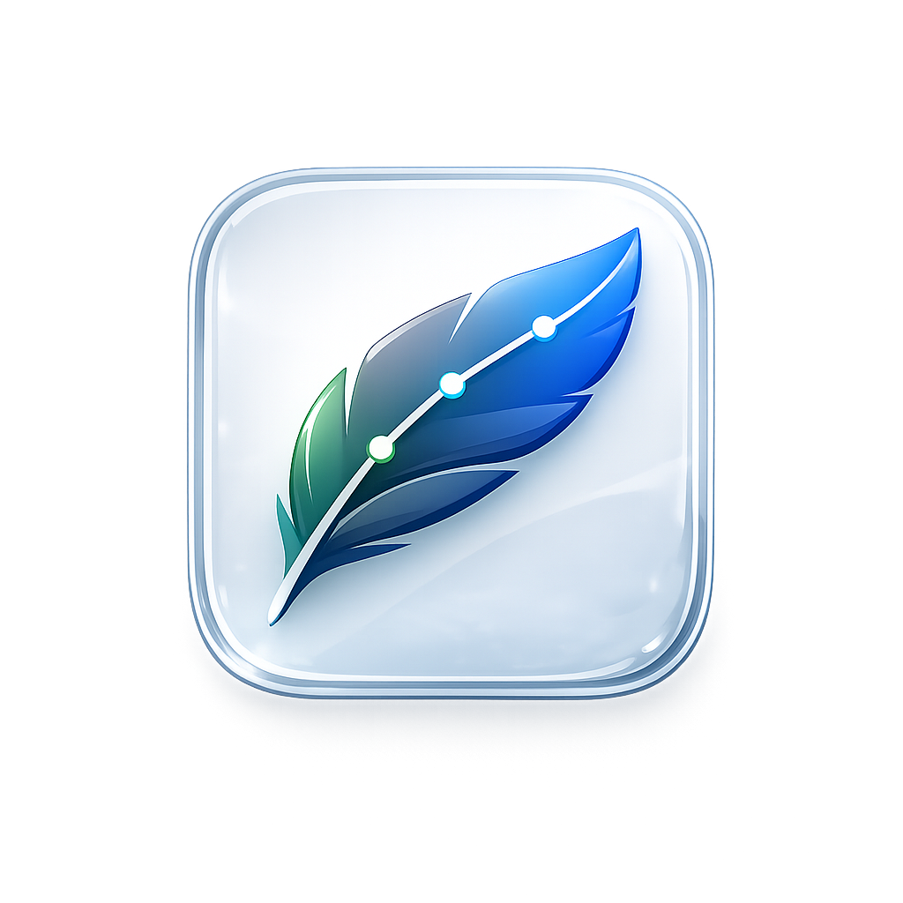

<p align="center">
  
</p>

# Plumage Bar

<p align="center">
  CPU · GPU · RAM monitoring in the macOS menu bar.
</p>

<p align="center">
  Calm, minimal, Liquid Glass — sits where you already look, nowhere else.
</p>

<p align="center">
  <a href="https://github.com/MolodykhV/mac-usage-tool/releases/latest">
    
  </a>
  
  
</p>

---

## What it is

A tiny, glanceable system monitor for macOS. Pick up to three numbers in your
menu bar — CPU, GPU, memory — see them at a glance, open the popover for a
60-second history graph and the top processes hogging your machine. That's it.

No window stealing focus. No dock icon. No fans of dashboards. Just the live
numbers you actually care about, dressed up in macOS Tahoe's Liquid Glass.

## Highlights

- **Three numbers in your menu bar.** CPU, GPU, memory — together or any
  subset you prefer.
- **Calm visuals.** Liquid Glass cards that float over your desktop, no
  unnecessary chrome, no jitter as percentages change.
- **Threshold alerts that don't spam.** One notification per sustained
  excursion, dwell time you control.
- **Six languages.** EN, RU, FR, ES, DE, 简体中文.
- **Native and frugal.** Swift 6 + SwiftUI, zero third-party dependencies,
  flat ~65 MB RSS and ~0% CPU at rest.

## Install

1. Grab the latest **`PlumageBar.dmg`** from
   [Releases](https://github.com/MolodykhV/mac-usage-tool/releases/latest).
2. Open the DMG, drag **Plumage Bar** to **Applications**.
3. On first launch, right-click the app → **Open** to bypass the unsigned-app
   warning (no Developer ID yet; signing + notarization land alongside the
   first stable release).

Requires macOS 26 (Tahoe) or later, Apple Silicon.

## Permissions

- **Notifications.** For threshold alerts. Granted on first launch via the
  system prompt, or anytime through *Settings → Thresholds → Open System
  Settings*.
- **Login Item.** Optional, off by default. Toggle in *Settings → General →
  Launch at login*.

Plumage Bar reads system-wide CPU, RAM and per-process stats through public
Mach APIs that need **no privileges**. GPU residency is read through the
`IOReport` system library; that runs in user space too — no sudo, no helper.

## Building from source

Requires macOS 26 + Xcode 26 (Swift 6.3).

```bash
make build     # compile the executable
make test      # 82 unit + integration tests
make app       # assemble ./dist/PlumageBar.app
make lint      # swift-format check
```

`Package.swift` opens directly in Xcode for IDE debugging.

## License

[MIT](LICENSE) © 2026 Vitaliy Molodykh
